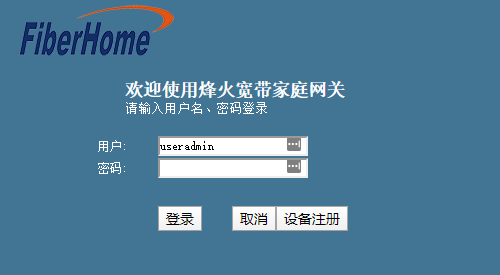
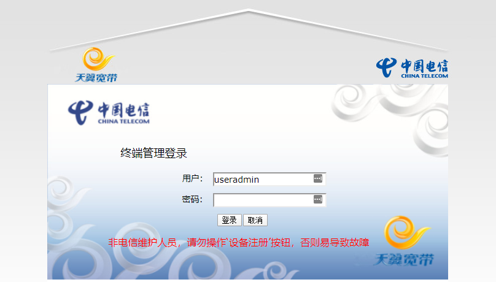

# 破解 电信天翼宽带家庭网关 <!-- omit in toc -->

- [手动破解](#手动破解)
- [一键破解？](#一键破解)

本文所设计的设备信息：

* 设备类型：GPON天翼网关(4口单频)
* 产品型号：HG6201T
* 硬件版本号：V2.1
* 软件版本号：V1.00.M5002

## 手动破解
1. 打开光猫管理页，确认设备型号、系统版本
2. 打开 `http://<光猫管理地址>:8080` 确认有web页面返回
     
   或（如果你在安徽？）  
     
   或（如果你在长青油田？、贵州广电？）  
     
3. 打开 `http://<光猫管理地址>:8080/cgi-bin/baseinfoSet.cgi` 确认有 json 内容返回
4. 找到键 "baseinfoSet_TELECOMACCOUNT" 与 "baseinfoSet_TELECOMPASSWORD"，分别代表超级管理员的用户名和密码
5. 对 "baseinfoSet_TELECOMPASSWORD" 进行密码逆运算  
   (可能会有差异，若失败，请根据 "baseinfoSet_USERPASSWORD" 与 光猫后贴的密码自行调整参数)
   ```py
   def pwdcalc(rawstr, offset = 4):
       pwd = ''
       rawstr = rawstr.rstrip('&')
       for n in map(int,rawstr.split('&')):
           if n in range(97,123):
               pwd += chr(((n - 97 - offset) % 26) + 97)
           elif n in range(65,91):
               pwd += chr(((n - 65 - offset) % 26) + 65)
           else:
               pwd += chr(n)
       return pwd
   ```
6. 通过获得的密码登录

## 一键破解？
<a href="hack_telecom.py" download target="_blank">小哥哥小姐姐快来点我啊，点一下玩一秒，坐牢坐到天荒地老</a>