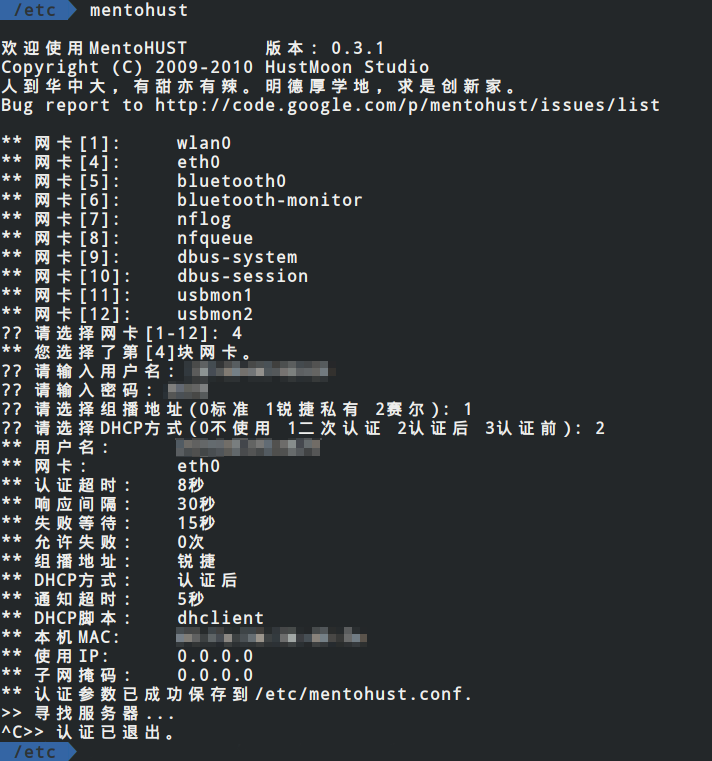
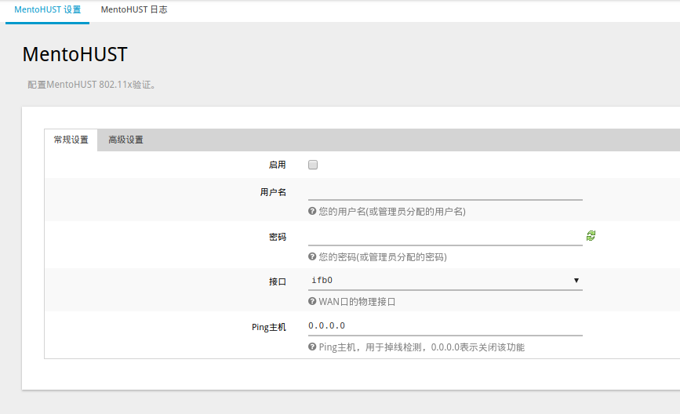

## 在路由器上跑MentoHUST <!-- omit in toc -->
**备忘录**  

- [编译与安装](#编译与安装)
- [配置（无LUCI）](#配置无luci)
- [配置（LUCI）](#配置luci)
- [进阶（无LUCI）](#进阶无luci)

#### 编译与安装
1. 在Git上拉[MentoHUST-OpenWrt-ipk](https://github.com/BoringCat/MentoHUST-OpenWrt-ipk)代码
```
pushd package
git clone https://github.com/BoringCat/MentoHUST-OpenWrt-ipk.git
pushd MentoHUST-OpenWrt-ipk
git checkout OpenWRT-18+ # 如果你是OpenWrt18+，这个分支修复了找不到libpcap.a的错误
git checkout LEDE-17+ # 未测试
popd
popd
```
2. （可选）在Git上拉[luci-app-mentohust](https://github.com/BoringCat/luci-app-mentohust)代码  
```
git clone https://github.com/BoringCat/luci-app-mentohust.git package/luci-app-mentohust
# 编译 po2lmo (如果有po2lmo可跳过)
pushd package/luci-app-mentohust/tools/po2lmo
make && sudo make install
popd
# 选择要编译的包 LuCI -> 3. Applications --> luci-app-mentohust
```

**OpenWRT 18+版本注意！** 解决一堆问题的方法：[Make-problem/Problem.md](../Make-problem/Problem.md#openwrt-18061-sdk-%E6%9B%B4%E6%96%B0feed%E6%8A%A5%E9%94%99)

3. 输入 `./scripts/feeds update -a` 更新依赖包， 输入`./scripts/feeds install libpcap` 安装 libpcap 依赖  

4. 输入`make menuconfig`，找到 Network--->Ruijie--->mentohust 将其设定为 '<M\>' 编译为ipk，或 '<\*>' 安装到编译出的固件中

5. 1. 若是从SDK中编译，输入`make package/MentoHUST-OpenWrt-ipk/compile V=s`编译mentohust包。若没有错误就可以在"bin/_$Arch_/packages/base"里面找到mentohust的ipk包(嫌麻烦可以直接`find bin -type f -name "mentohust*.ipk"`)  
 **注意：SDK中貌似不能直接输入`make`来编译所有包(隔壁 Kratosmax 翻车了)**

 2. 若是从源码中编译， 则可以输入`make V=s`(或`make -j$(cpu核心数+2)`)编译整个LEDE路由系统。具体固件生成的位置要翻阅一下官方文档(我只搞过x86的，它是直接在bin/x86下面)。即使是是编译固件也会生成ipk包，在 bin/_$Arch_/packages 内

6. 安装ipk或安装固件

#### 配置（无LUCI）
+ 初始化
>直接输入`mentohust`运行程序 (在路由器上可能会遇到显示不全的情况，可直接输入，此时不能出错，因为你的退格变成了^H(string))  
第一个输入内容：网卡，看不到就随便写1到3，初始化完成后可以到配置文件中更改  
第二个输入内容：用户名  
第三个输入内容：密码(密码写入配置文件后会加密，请务必填写正确)  
第四个输入内容：组播地址(0标准 1锐捷私有 2赛尔)  
第五个输入内容：DHCP方式(0不使用 1二次认证 2认证后 3认证前)  
接着按Ctrl+C结束进程，修改配置文件。  
>  
>  
>`/etc/mentohust.conf`  
>其中：  
>  
>Username 是 用户名  
Nic 是 网卡名称(可通过`ifconfig`或`ip l`查看)  
IP 是 验证要用的IP地址(默认填入所选网卡当前IP地址)(DHCP环境可以设为0.0.0.0)  
Mask 是 子网掩码(默认填入所选网卡当前IP子网掩码)(DHCP环境可以设为0.0.0.0)  
Gateway 是 网关，如果指定了就会监视网关ARP信息(我的配置文件原话)  
PingHost 是 Ping主机，用于掉线检测，0.0.0.0表示关闭该功能(原话)(意思是隔段时间ping一下那个IP，如果不通就证明断线)  
Timeout 是 每次发包超时时间（秒）  
EchoInterval 是 发送Echo包的间隔（秒）  
RestartWait 是 失败等待时间（秒）认证失败后等待RestartWait秒或者服务器请求后重启认证  
MaxFail 是 最大失败次数(0为无限)
StartMode 是 寻找服务器时的组播地址类型 0标准 1锐捷 2将MentoHUST用于赛尔认证  
DhcpMode 是 DHCP方式 0(不使用) 1(二次认证) 2(认证后) 3(认证前)  
DaemonMode 表示 是否后台运行: 0(否) 1(是，关闭输出) 2(是，保留输出) 3(是，输出到文件/tmp/mentohust.log)  
ShowNotify 表示 是否显示通知： 0(否) 1~20(是)  
Version 是 客户端版本号，如果未开启客户端校验但对版本号有要求，可以在此指定，形如3.30  
DataFile 是 认证数据文件，如果需要校验客户端，就需要正确设置  
DhcpScript 是 进行DHCP的脚本  

#### 配置（LUCI）
**确保已安装luci-app-mentohust。并且在`$PATH`环境变量所表示的搜索路径中存在`mentohust`**
+ 基本配置  
进入LUCI后台，选择 服务(services) --> MentoHUST  
默认界面如下：  
  
输入你的用户名、密码，选择网卡接口以后 "保存并应用" 就可以进行验证了  
(网卡接口是：网络(Network) --> 接口(Interfaces) 里面WAN口的物理接口)
+ 高级配置  
~~不修改都是默认~~  
其中：IP地址(IP Address)、子网掩码(NetMark)、网关(GateWay)、DNS服务器(DNS Server) 都无关紧要（我全不要.jpg）  
可能所需更改的选项仅为：组播地址类型 与 DHCP设置  
  
所有选项均有提示文本(English version translate by Google)
+ 查看日志  
都看到了吧：  
点击一下就可以切换到日志界面了  
再点一下就可以当成刷新了  
没有日志的话是mentohust的没有清除stdout缓冲区，回到基本配置那边取消勾选"启用"，"保存并应用"后再回来看看 (或者修改mentohust的源码，再每个printf后面加上`fflush(stdout)`)  
**注意：不要在日志界面点"保存与应用"，我点了以后无限"正在应用更改"。源码中该页面并不会响应这个操作**
+ 开机自启？  
对！搞了LUCI界面后支持init.d脚本开机自启了！  
默认优先级是90，应该能在网卡初始化完成以后在运行
不行就上来点一次 "保存与应用" 吧  
~~_我看隔壁shadowsock都是90，应该可以的吧_~~

#### 进阶（无LUCI）
+ 开机脚本  
**注：使用开机脚本运行mentohust必须在配置文件中将DaemonMode设为非0**  
由于 [MentoHUST-OpenWrt-ipk](https://github.com/KyleRicardo/MentoHUST-OpenWrt-ipk) 并没有init.d脚本，所以..............不装 luci-app-mentohust 就无法实现原生开机自启。只能写在rc.local中  
在rc.local中直接添加`mentohust`后又发现，经常无法自启。查原因发现是由于网卡未初始化mentohust就以及开始进行认证...................  
于是修改开机脚本为先判断指定网卡是否有IP地址(通过ip或ip-full包)  
网卡以eth0为例  
`/etc/rc.local`  
```
...
while [ "$(ip a sh eth0 | grep inet | grep -v inet6)" == "" ]
do
sleep 1
done
mentohust
...
exit 0
```
$$