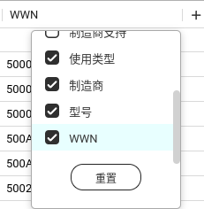

# 从系统阵列中移除HDD <!-- omit from toc -->

**本文环境：**
> 型号: TS-h973AX  
> BIOS 版本: Q071AR07  
> 固件版本: QuTS hero h5.1.2.2534 Build 20230927  

- [查找硬盘](#查找硬盘)
- [查找阵列](#查找阵列)
- [操作](#操作)
  - [从系统阵列中移除硬盘](#从系统阵列中移除硬盘)
  - [移除Swap阵列](#移除swap阵列)
  - [清理阵列信息](#清理阵列信息)
- [最终效果](#最终效果)

## 查找硬盘
首先，你得找到硬盘的逻辑设备，不是说页面上显示是第X块硬盘，设备就是 `/dev/sdX` 的。我这里是第1、3、5插槽，对应的设备是  /dev/sdf、/dev/sdg、/dev/sde


1. 打开存储与快照总管
2. 选到 存储 => 磁盘/VJBOD
3. 打开磁盘列表的 WWN 列  
   
4. 复制你想要找的WWN
5. 构建查找命令  
   ```bash
   grep -Ei '${WWN1}|${WWN2}|${WWN3}' /sys/block/*/device/wwid
   ```
6. 执行命令获得设备

## 查找阵列

1. SSH登录NAS
2. `cat /proc/mdstat` 获取阵列信息
3. 找到包含硬盘逻辑设备的阵列，例如 md9、md13
4. 记录下各阵列中的磁盘分区逻辑设备信息  
   例如：
    - md9: sde1, sdf1, sdg1
    - md13: sde4, sdf4, sdg4
    - md322: sde5, sdf5, sdg5
5. `cat /proc/swaps` 获取swap信息

## 操作
### 从系统阵列中移除硬盘
```bash
mdadm /dev/mdX --fail /dev/sdYZ
```
> 例如：
> ```bash
> mdadm /dev/md9 --fail /dev/sde1
> mdadm /dev/md9 --fail /dev/sdf1
> mdadm /dev/md9 --fail /dev/sdg1
> mdadm /dev/md13 --fail /dev/sde4
> mdadm /dev/md13 --fail /dev/sdf4
> mdadm /dev/md13 --fail /dev/sdg4
> ```

### 移除Swap阵列
<font color=red>**注意：如果你的系统中只有一个swap阵列，那就不应该移除它**</font>
```bash
mdadm --stop /dev/md32x
```

### 清理阵列信息
~~*不过Swap阵列每次启动都会重建，不太建议清理*~~
```bash
mdadm --zero-superblock /dev/sdYZ
```
> 例如：
> ```bash
> mdadm --zero-superblock /dev/sde1
> mdadm --zero-superblock /dev/sdf1
> mdadm --zero-superblock /dev/sdg1
> mdadm --zero-superblock /dev/sde4
> mdadm --zero-superblock /dev/sdf4
> mdadm --zero-superblock /dev/sdg4
> ```


## 最终效果
那当然是响应速度极快  

加上存储池没有访问的话，硬盘终于可以进入待机模式了  
