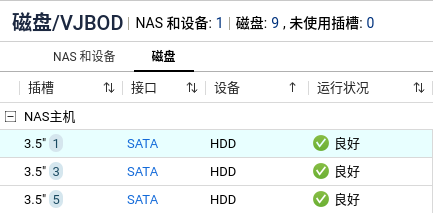
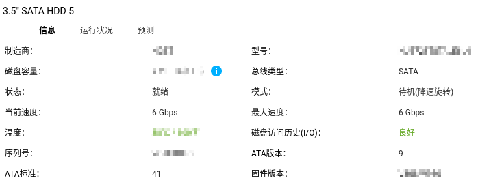

# 从系统阵列中移除HDD <!-- omit from toc -->

**本文环境：**
> 型号: TS-h973AX  
> BIOS 版本: Q071AR07  
> 固件版本: QuTS hero h5.1.2.2534 Build 20230927  

- [查找硬盘](#查找硬盘)
- [查找阵列](#查找阵列)
- [操作](#操作)
  - [从系统阵列中移除硬盘](#从系统阵列中移除硬盘)
  - [移除Swap阵列](#移除swap阵列)
  - [清理阵列信息](#清理阵列信息)
- [最终效果](#最终效果)

## 查找硬盘
首先，你得找到硬盘的逻辑设备，不是说页面上显示是第X块硬盘，设备就是 `/dev/sdX` 的。我这里是第1、3、5插槽，对应的设备是  /dev/sdi、/dev/sdg、/dev/sde  


1. 获取插槽ID
2. 获取设备
   ```bash
   ls -alhF /dev/qzfs/enc_0/disk_0x{1,3,5}_* | cut -d'>' -f2 | sed 's/.$//' | uniq
   ```

## 查找阵列

1. SSH登录NAS
2. `cat /proc/mdstat` 获取阵列信息  
   ```
   md322 : active raid1 sde5[3](S) sdg5[2] sdi5[0]
      32916992 blocks super 1.0 [2/2] [UU]
      bitmap: 0/1 pages [0KB], 65536KB chunk

   md321 : active raid1 sdd5[6](S) sdc5[5](S) sdb5[4](S) sda5[3](S) sdf5[2] sdh5[0]
      32916992 blocks super 1.0 [2/2] [UU]
      bitmap: 0/1 pages [0KB], 65536KB chunk

   md13 : active raid1 sdf4[0] sdg4[130] sdi4[129] sde4[128] sdd4[5] sdc4[4] sda4[3] sdb4[2] sdh4[1]
         458880 blocks super 1.0 [128/9] [UUUUUUUUU_______________________________________________________________________________________________________________________]
         bitmap: 1/1 pages [4KB], 65536KB chunk

   md9 : active raid1 sdf1[0] sdg1[130] sde1[129] sdi1[128] sdd1[5] sdc1[4] sda1[3] sdb1[2] sdh1[1]
         530048 blocks super 1.0 [128/9] [UUUUUUUUU_______________________________________________________________________________________________________________________]
         bitmap: 1/1 pages [4KB], 65536KB chunk
   ```
3. `cat /proc/swaps` 获取swap信息

   | Filename | Type | Size | Used | Priority |
   | :-       | :-   | :-   | :-   | :-       |
   | `/dev/md321` | partition | 32916988 | xxx | -2 |
   | `/dev/md322` | partition | 32916988 | 0 | -3 |

4. 找到包含硬盘逻辑设备的阵列，例如 md9、md13、md322
5. 记录下各阵列中的磁盘分区逻辑设备信息  
   例如：  

   | 阵列 | 设备 |
   | -:    | :- |
   | `md9`   | `sdi1` `sdg1` `sde1` |
   | `md13`  | `sdi4` `sdg4` `sde4` |
   | `md322` | `sdi5` `sdg5` `sde5` |


## 操作
### 从系统阵列中移除硬盘
```bash
mdadm /dev/mdX --fail /dev/sdYZ
```
> 例如：
> ```bash
> mdadm /dev/md9 --fail /dev/sdi1
> mdadm /dev/md9 --fail /dev/sdg1
> mdadm /dev/md9 --fail /dev/sde1
> mdadm /dev/md13 --fail /dev/sdi4
> mdadm /dev/md13 --fail /dev/sdg4
> mdadm /dev/md13 --fail /dev/sde4
> ```

### 移除Swap阵列
<font color=red>**注意：如果你的系统中只有一个swap阵列，那就不应该移除它**</font>
```bash
swapoff /dev/md32x
mdadm --stop /dev/md32x
```

### 清理阵列信息
~~*不过Swap阵列每次启动都会重建，不太建议清理*~~
```bash
mdadm --zero-superblock /dev/sdYZ
```
> 例如：
> ```bash
> mdadm --zero-superblock /dev/sdi1
> mdadm --zero-superblock /dev/sdg1
> mdadm --zero-superblock /dev/sde1
> mdadm --zero-superblock /dev/sdi4
> mdadm --zero-superblock /dev/sdg4
> mdadm --zero-superblock /dev/sde4
> ```


## 最终效果
那当然是响应速度极快  

加上存储池没有访问的话，硬盘终于可以进入待机模式了  
