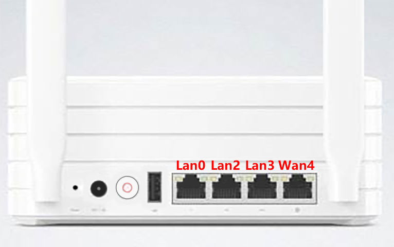

## 如何更改小米路由器R2D的VLAN配置 <!-- omit in toc -->
**本文所有终端文本编辑器均为vim，若不熟悉vim可用nano代替**

1. **基础配置**  
> **vim /etc/config/network**  
&emsp;&emsp;1、从switch_vlan 'eth0_1'中去除你想用的端口并记住端口号 (具体端口号文末给出)  
&emsp;&emsp;2、在config interface 'loopback'前添加一个switch\_vlan的配置，其中option vlan的值不能与前两个重复。建议配置按照规范命名  
&emsp;&emsp;3、在文件末尾添加interface配置，命名不能与前面三个配置相同，其中option ifname为eth0._"option vlan的值"_，其余配置均可在<a href="https://wiki.openwrt.org/doc/uci/network" target="_blank">OpenWrt Wiki - Network configuration</a>中查询

1. **特殊配置**  
**以下所有添加的vlan后面的'*'均为"基础配置中设定的VLAN值"**
> vim /etc/config/misc  
&emsp;&emsp;1、找到config misc ports  
&emsp;&emsp;2、在默认的option vlan1中去除你想用的端口  
&emsp;&emsp;3、在option vlan2下添加option vlan\*，值为"_你想用的端口_+(空格)+5"。例：option vlan3 '3 5' (“5”后面需不需要 '\*' 我也不清楚，我没加 '\*' 也能用)  
&emsp;&emsp;4、在option vlan2_bridgeap下添加option vlan\*\_bridgeap，值为"5"。例：option vlan\*\_bridgeap '5'  
&emsp;&emsp;5、若想将端口用于第二wan口，建议将config misc sw\_reg里的option sw\_lan\_ports与option sw\_wan\_port按实际用途更改 (此处可提交issues改进)
> 
> nvram  
输入nvram show 2>/dev/null | grep vlan后输出整理如下  
> ```
> vlan1hwname=et0  
> vlan1ports=0 2 3 5*  
> vlan2hwname=et0  
> vlan2ports=4 5  
> lan_vlan_id=1  
> br0_ifnames=vlan1 wl0 wl1  
> lan_ifnames=vlan1 wl0 wl1   
> landevs=vlan1 wl0 wl1  
> wl0_vlan_prio_mode=off  
> wl1_vlan_prio_mode=off  
> ```
需要将"基础配置中设定的VLAN值"加入nvram中  
1、输入 `nvram set vlan*hwname=et0`  
2、输入 `nvram set vlan*ports='$(你想用的端口) 5'`  
3、输入 `nvram commit` 保存配置

### 小米路由器R2D switch端口与物理端口对应
**注：“Lan”与“Wan”均为出厂默认，数字为对应端口号**  

