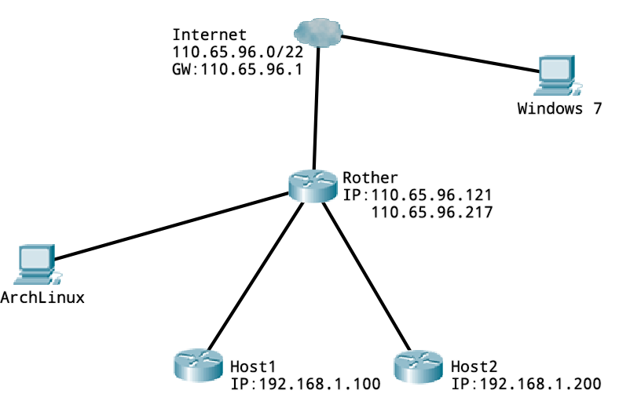
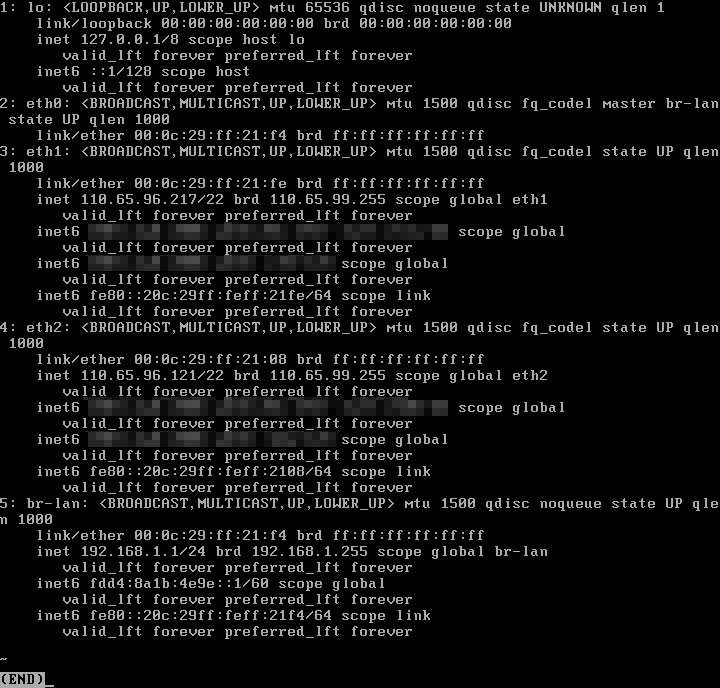
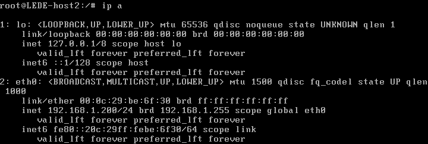
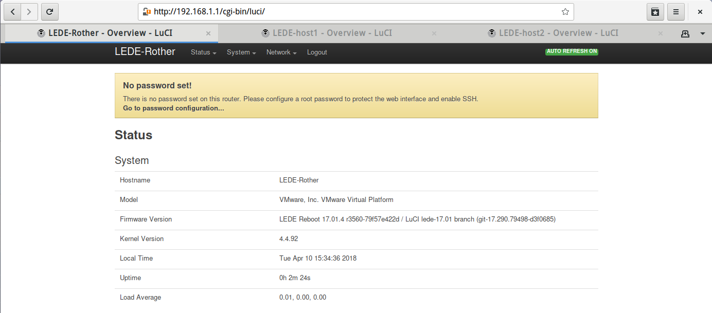
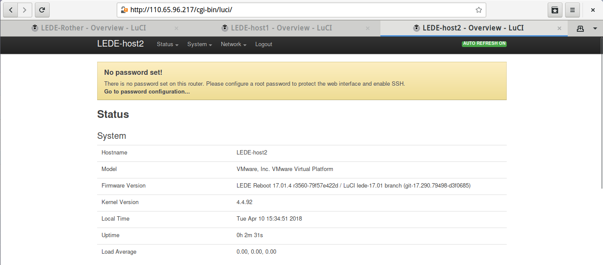
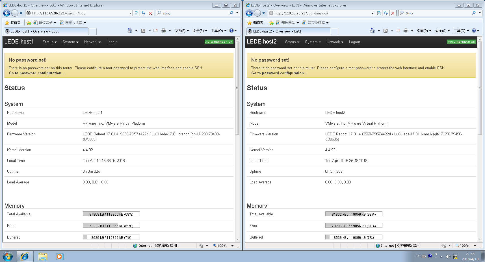

## 在OpenWrt/LEDE设置静态网络地址转换 <!-- omit in toc -->
**实验环境Vmware14.0、LEDE x86_64 17.01.4**  

- [网络拓扑](#网络拓扑)
- [配置文件](#配置文件)
- [实验过程](#实验过程)
- [实验成果图片](#实验成果图片)

### 网络拓扑
  
### 配置文件
**/etc/config/firewall**
```
......

config redirect
	option target 'DNAT'
	option src 'wan'
	option dest 'lan'
	option dest_ip '$(内网IP)'
	option name '$(名字)'
	option proto 'tcp udp icmp'
	option src_dip '$(外网IP)'

......
```

**LUCI**  
  

### 实验过程
> #### 0. 建立实验环境
> **Rother:**  
  
> **Host1:**  
  
> **Host2:**  
  
> #### 1. 启动虚拟机并更改hostname
>将各虚拟机按照拓扑命名
> #### 2. 配置DHCP保留地址
>在 Rother 的 DHCP and DNS / Static Leases 中设置 Host1 和 Host2 的保留地址为 192.168.1.100 和 192.168.1.200  
  
> #### 3. 按照官网的<a href="https://openwrt.org/docs/guide-user/firewall/firewall_configuration#simple_dmz_rule" target="_blank">Wiki</a>配置简单的DHZ规则
>在 Rother 的 /etc/config/firewall 中加入以下内容
> ```
> config redirect
>	option src 'wan'
>	option proto 'all'
>	option dest_ip '192.168.1.100'
> ```
>重启防火墙后确认 Windows 7 能通过访问 110.65.96.121 来访问 Host1，但是也能通过 110.65.96.217 访问。并不符合预期
> #### 4. 按照网络上查找到的资料配置端口转发
>在 Rother 的 network/firewall/forwards 中配置端口转发
>
>|项目|值|
>| :-: | :-: |
>|共享名| DMZ100 |
>|协议| TCP+UDP |
>|外部区域| wan |
>|外部 IP 地址| 110.65.96.121 |
>|外部端口| 1-65535 |
>|内部区域| lan |
>|内部 IP 地址|192.168.1.100|
>|内部端口| 1-65535 |
>|启用 NAT 环回| √ |
>
>|项目|值|
>| :-: | :-: |
>|共享名| DMZ200 |
>|协议| TCP+UDP |
>|外部区域| wan |
>|外部 IP 地址| 110.65.96.217 |
>|外部端口| 1-65535 |
>|内部区域| lan |
>|内部 IP 地址|192.168.1.200|
>|内部端口| 1-65535 |
>|启用 NAT 环回| √ |
>
>这会在 /etc/config/firewall 中加入以下内容：
> ```
> config redirect
>	option target 'DNAT'
>	option src 'wan'
>	option dest 'lan'
>	option dest_ip '192.168.1.100'
>	option name 'DMZ100'
>	option proto 'tcp udp icmp'
>	option src_dip '110.65.96.121'
>	option src_dport '1-65535'
>	option dest_port '1-65535'
>
> config redirect
>	option target 'DNAT'
>	option src 'wan'
>	option dest 'lan'
>	option dest_ip '192.168.1.200'
>	option name 'DMZ200'
>	option proto 'tcp udp icmp'
>	option src_dip '110.65.96.217'
>	option src_dport '1-65535'
>	option dest_port '1-65535'
> ```
>重启防火墙后确认 Windows 7 能通过访问 110.65.96.121 来访问 Host1，也能通过 110.65.96.217 访问 Host2。符合预期。  
>但是无论 Host1 与 Host2 是否离线，在 Windows 7 使用 ping 命令时都能获得回应，且 ttl=64
> #### 5. 真正的静态静态网络地址转换
>由于ICMP没有端口这种说法，于是只转发所有端口并不可取。  
>尝试关闭 Rother 的防火墙规则 Allow-Ping 并加上允许转发 ICMP 的规则，但没有生效。
>于是尝试在 Rother 的 network/firewall/forwards 中修改各个端口转发配置
>
>|修改项目|值|
>| :-: | :-: |
>|共享名| DMZ100 |
>|外部端口|  |
>|内部端口|  | |
>
>|修改项目|值|
>| :-: | :-: |
>|共享名| DMZ200 |
>|外部端口|  |
>|内部端口|  | |
>
>对！都改成空！
>
>这会在 /etc/config/firewall 中 name=DMZ100 和 name=DMZ200 的规则中去掉以下内容：
> ```
>	option src_dport '1-65535'
>	option dest_port '1-65535'
> ```
>重启防火墙后确认 Windows 7 能通过访问 110.65.96.121 来访问 Host1，也能通过 110.65.96.217 访问 Host2。  
执行命令 `ping 110.65.96.121` 与 `ping 110.65.96.217` 得到 ttl=63 的正确值。  
断开 Host2 的 网络连接后确认到 `ping 110.65.96.217` 超时，并且 Host2 内置的 LUCI 页面也无法打开。
### 实验成果图片
  
  
  
  
