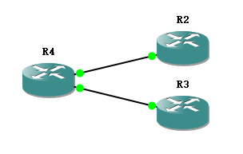

# 使用SLA检测链路状态，实现自动路由切换 <!-- omit in toc -->


## 测试环境  
**GNS3：**2.2.16 + GNS3 KVM 2.2.16  

**设备：**Cisco 7200 124-24.T5  
CHECKSUM：6b89d0d804e1f2bb5b8bda66b5692047  

**拓扑：**  


**线路连接：**  
R4 F0/0 ---> R2 F0/0  
R4 F0/1 ---> R3 F0/0  

## 测试过程

1. 配置对端
   - R2 Config
     ```
     interface Loopback8
       ip address 8.8.8.8 255.255.255.255
     !
     interface FastEthernet0/0
       ip address 10.0.0.1 255.255.255.248
       no shutdown
     !
     ```
   - R3 Config
     ```
     interface Loopback8
       ip address 8.8.8.8 255.255.255.255
     !
     interface FastEthernet0/0
       ip address 10.0.0.9 255.255.255.248
       no shutdown
     !
     ```

2. 配置本地端  
**`R4 config`**  
    ```
    interface FastEthernet0/0
      ip address 10.0.0.2 255.255.255.248
      no shutdown
    !
    interface FastEthernet0/1
      ip address 10.0.0.10 255.255.255.248
    no shutdown
    !
    ip route 8.8.8.8 255.255.255.255 10.0.0.1 100
    ip route 8.8.8.8 255.255.255.255 10.0.0.9 101
    ```

1. 检查路由  
**`R4 show ip route`**

    ```
         8.0.0.0/32 is subnetted, 1 subnets
    S       8.8.8.8 [100/0] via 10.0.0.1
    S       8.8.8.8 [101/0] via 10.0.0.9
    ```

4. 检查Ping  
**`R4 ping 8.8.8.8`**

    ```
    Type escape sequence to abort.
    Sending 5, 100-byte ICMP Echos to 8.8.8.8, timeout is 2 seconds:
    !!!!!
    Success rate is 100 percent (5/5), round-trip min/avg/max = 8/16/36 ms
    ```

5. 断开R2  
**`R2 config`**

    ```
    R2#conf t
    R2(config)#int f0/0
    R2(config-if)#shu
    *Mar 1 00:07:46.003: %LINK-5-CHANGED: Interface FastEthernet0/0, changed state to administratively down
    *Mar 1 00:07:47.003: %LINEPROTO-5-UPDOWN: Line protocol on Interface FastEthernet0/0, changed state to down
    ```

6. 检查Ping  
**`R4 ping 8.8.8.8`**

    ```
    Type escape sequence to abort.
    Sending 5, 100-byte ICMP Echos to 8.8.8.8, timeout is 2 seconds:
    .....
    Success rate is 0 percent (0/5)
    ```

7. 配置SLA  
**`R4 config`**

    ```
    R4(config)#ip sla 1
    R4(config-ip-sla)#icmp-echo 10.0.0.1
    R4(config-ip-sla-echo)#timeout 5000
    R4(config-ip-sla-echo)#frequency 5
    R4(config-ip-sla-echo)#exit
    R4(config)#ip sla schedule 1 start-time now life forever
    R4(config)#track 1 ip sla 1 reachability
    R4(config)#
    R4(config)#ip sla 2
    R4(config-ip-sla)#icmp-echo 10.0.0.9
    R4(config-ip-sla-echo)#timeout 5000
    R4(config-ip-sla-echo)#frequency 5
    R4(config-ip-sla-echo)#exit
    R4(config)#ip sla schedule 2 start-time now life forever
    R4(config)#track 2 ip sla 2 reachability
    R4(config)#
    R4(config)#no ip route 8.8.8.8 255.255.255.255
    R4(config)#ip route 8.8.8.8 255.255.255.255 10.0.0.1 track 1 100
    R4(config)#ip route 8.8.8.8 255.255.255.255 10.0.0.9 track 2 101
    ```

8. 检查路由  
**`R4 show ip route`**

    ```
         8.0.0.0/32 is subnetted, 1 subnets
    S       8.8.8.8 [101/0] via 10.0.0.9
    ```

9.  检查Ping  
**`R4 show ip sla statistics`**

    ```
    IPSLAs Latest Operation Statistics
      
    IPSLA operation id: 1
    Type of operation: icmp-echo
    Latest RTT: NoConnection/Busy/Timeout
    Latest operation start time: *08:22:36.291 UTC Fri Nov 27 2020
    Latest operation return code: Timeout
    Number of successes: 0
    Number of failures: 8
    Operation time to live: Forever
    
    IPSLA operation id: 2
    Type of operation: icmp-echo
    Latest RTT: 28 milliseconds
    Latest operation start time: *08:22:41.711 UTC Fri Nov 27 2020
    Latest operation return code: OK
    Number of successes: 4
    Number of failures: 0
    Operation time to live: Forever
    ```

1.   连接R2  
**`R2 config`**

    ```
    R2#conf t
    R2(config)#int f0/0
    R2(config-if)#no sh
    *Mar 1 00:36:37.707: %LINK-3-UPDOWN: Interface FastEthernet0/0, changed state to up
    *Mar 1 00:36:38.707: %LINEPROTO-5-UPDOWN: Line protocol on Interface FastEthernet0/0, changed state to up
    ```

1.   获取日志  
**`R4 Logs`**

    ```
    *Nov 27 08:26:21.059: %TRACKING-5-STATE: 1 ip sla 1 reachability Down->Up
    ```

1.  检查路由  
**`R4 show ip route`**

    ```
        8.0.0.0/32 is subnetted, 1 subnets
    S       8.8.8.8 [100/0] via 10.0.0.1
    ```

13. 检查Ping  
**`R4 show ip sla statistics`**

    ```
    IPSLAs Latest Operation Statistics
    
    IPSLA operation id: 1
    Type of operation: icmp-echo
    Latest RTT: 8 milliseconds
    Latest operation start time: *08:58:01.303 UTC Fri Nov 27 2020
    Latest operation return code: OK
    Number of successes: 382
    Number of failures: 29
    Operation time to live: Forever

    IPSLA operation id: 2
    Type of operation: icmp-echo
    Latest RTT: 16 milliseconds
    Latest operation start time: *08:58:01.711 UTC Fri Nov 27 2020
    Latest operation return code: OK
    Number of successes: 428
    Number of failures: 0
    Operation time to live: Forever
    ```