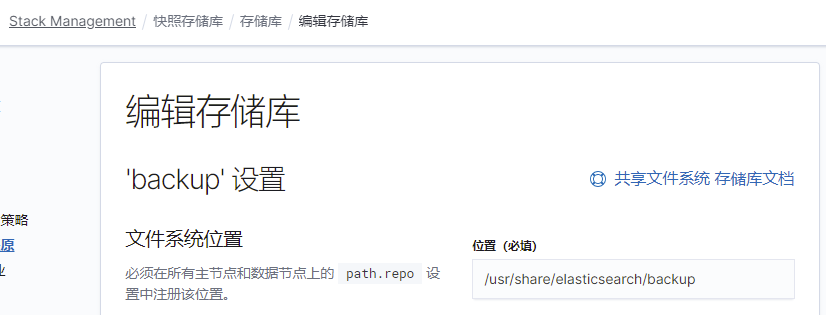

# Zabbix + ElasticSearch + ilm 解决方案  <!-- omit in toc -->

- [Zabbix配置](#zabbix配置)
  - [官方文档](#官方文档)
  - [配置文件](#配置文件)
- [ElasticSearch配置](#elasticsearch配置)
  - [快照](#快照)
    - [配置文件](#配置文件-1)
    - [确认配置](#确认配置)
    - [存储库](#存储库)
    - [策略](#策略)
  - [索引生命周期 index lifecycle management (ilm)](#索引生命周期-index-lifecycle-management-ilm)
  - [模板](#模板)
  - [管道](#管道)
  - [初始索引](#初始索引)
- [Docker环境](#docker环境)
  - [Zabbix](#zabbix)
  - [ElasticSearch](#elasticsearch)

## Zabbix配置
### 官方文档
- [4.4 - EN][1]
- [5.0 - ZH][2]

### 配置文件
``` conf
### Option: HistoryStorageURL
#       History storage HTTP[S] URL.
#
# Mandatory: no
# Default:
# HistoryStorageURL=
HistoryStorageURL=http://es:9200

### Option: HistoryStorageTypes
#       Comma separated list of value types to be sent to the history storage.
#
# Mandatory: no
# Default:
# HistoryStorageTypes=uint,dbl,str,log,text
HistoryStorageTypes=uint,dbl,str,log,text
```

## ElasticSearch配置
**以 7.10.1 为例，6.x可能会有所不同**  
**使用云商的ElasticSearch实例时，可以跳过快照配置**
### 快照
#### 配置文件
``` yml
path.repo: ["/path/to/snapshot/storage"]
```
#### 确认配置
``` json
GET /_nodes?filter_path=nodes.*.settings.path.repo
{
  "nodes" : {
    "oAx85JScSz2qDvcEZ09EXw" : {
      "settings" : {
        "path" : {
          "repo" : [
            "/usr/share/elasticsearch/backup"
          ]
        }
      }
    },
    "9vA5w7AvSS2gwp3aNbdLIA" : {
      "settings" : {
        "path" : {
          "repo" : [
            "/usr/share/elasticsearch/backup"
          ]
        }
      }
    },
    "ITQNkZKCRnS0ygDHnRUjxA" : {
      "settings" : {
        "path" : {
          "repo" : [
            "/usr/share/elasticsearch/backup"
          ]
        }
      }
    }
  }
}
```
#### 存储库

#### 策略
**注：按实际情况配置**  

### 索引生命周期 index lifecycle management (ilm)
描述：主分片数据量达到 50G，或者存在时间超过 31天 后，滚动到下一个索引写入。滚动完成后，索引保留 1年 后删除  
这里命名为 zabbix-roll
``` json
{
  "policy": {
    "phases": {
      "hot": {
        "min_age": "0ms",
        "actions": {
          "rollover": {
            "max_size": "50gb",
            "max_age": "31d"
          },
          "set_priority": {
            "priority": 100
          }
        }
      },
      "delete": {
        "min_age": "365d",
        "actions": {
          "wait_for_snapshot": {
            "policy": "每日快照"
          }
        }
      }
    }
  }
}
```
### 模板
创建模板前，请预估数据量和写入速率，合理调整分片数
``` json
{
  "uint_template" : {
    "order" : 0,
    "index_patterns" : [
      "uint*"
    ],
    "settings" : {
      "index" : {
        "lifecycle" : {
          "name" : "zabbix-roll",
          "rollover_alias" : "uint"
        },
        "refresh_interval" : "30s",
        "auto_expand_replicas" : "0-1",
        "number_of_replicas" : "0"
      }
    },
    "mappings" : {
      "properties" : {
        "itemid" : {
          "type" : "long"
        },
        "clock" : {
          "format" : "epoch_second",
          "type" : "date"
        },
        "value" : {
          "type" : "long"
        }
      }
    },
    "aliases" : { }
  },
  "dbl_template" : {
    "order" : 0,
    "index_patterns" : [
      "dbl*"
    ],
    "settings" : {
      "index" : {
        "lifecycle" : {
          "name" : "zabbix-roll",
          "rollover_alias" : "dbl"
        },
        "refresh_interval" : "30s",
        "auto_expand_replicas" : "0-1",
        "number_of_replicas" : "0"
      }
    },
    "mappings" : {
      "properties" : {
        "itemid" : {
          "type" : "long"
        },
        "clock" : {
          "format" : "epoch_second",
          "type" : "date"
        },
        "value" : {
          "type" : "double"
        }
      }
    },
    "aliases" : { }
  },
  "str_template" : {
    "order" : 0,
    "index_patterns" : [
      "str*"
    ],
    "settings" : {
      "index" : {
        "lifecycle" : {
          "name" : "zabbix-roll",
          "rollover_alias" : "str"
        },
        "refresh_interval" : "30s",
        "auto_expand_replicas" : "0-1",
        "number_of_replicas" : "0"
      }
    },
    "mappings" : {
      "properties" : {
        "itemid" : {
          "type" : "long"
        },
        "clock" : {
          "format" : "epoch_second",
          "type" : "date"
        },
        "value" : {
          "index" : false,
          "fields" : {
            "analyzed" : {
              "analyzer" : "standard",
              "index" : true,
              "type" : "text"
            }
          },
          "type" : "text"
        }
      }
    },
    "aliases" : { }
  },
  "text_template" : {
    "order" : 0,
    "index_patterns" : [
      "text*"
    ],
    "settings" : {
      "index" : {
        "lifecycle" : {
          "name" : "zabbix-roll",
          "rollover_alias" : "text"
        },
        "refresh_interval" : "30s",
        "auto_expand_replicas" : "0-1",
        "number_of_replicas" : "0"
      }
    },
    "mappings" : {
      "properties" : {
        "itemid" : {
          "type" : "long"
        },
        "clock" : {
          "format" : "epoch_second",
          "type" : "date"
        },
        "value" : {
          "index" : false,
          "fields" : {
            "analyzed" : {
              "analyzer" : "standard",
              "index" : true,
              "type" : "text"
            }
          },
          "type" : "text"
        }
      }
    },
    "aliases" : { }
  },
  "log_template" : {
    "order" : 0,
    "index_patterns" : [
      "log*"
    ],
    "settings" : {
      "index" : {
        "lifecycle" : {
          "name" : "zabbix-roll",
          "rollover_alias" : "log"
        },
        "refresh_interval" : "30s",
        "auto_expand_replicas" : "0-1",
        "number_of_replicas" : "0"
      }
    },
    "mappings" : {
      "properties" : {
        "itemid" : {
          "type" : "long"
        },
        "clock" : {
          "format" : "epoch_second",
          "type" : "date"
        },
        "value" : {
          "index" : false,
          "fields" : {
            "analyzed" : {
              "analyzer" : "standard",
              "index" : true,
              "type" : "text"
            }
          },
          "type" : "text"
        }
      }
    },
    "aliases" : { }
  }
}
```
### 管道
``` json
{
  "uint-pipeline" : {
    "description" : "uint index naming",
    "processors" : [
      {
        "convert" : {
          "field" : "clock",
          "type" : "long"
        }
      },
      {
        "convert" : {
          "field" : "ns",
          "type" : "long"
        }
      },
      {
        "script" : {
          "source" : "ctx.timestamp = ctx.clock * 1000 + ctx.ns / 10000000"
        }
      },
      {
        "date" : {
          "field" : "timestamp",
          "formats" : [
            "UNIX_MS"
          ],
          "timezone" : "Asia/Shanghai"
        },
        "remove" : {
          "field" : "timestamp"
        }
      }
    ]
  },
  "dbl-pipeline" : {
    "description" : "dbl index naming",
    "processors" : [
      {
        "convert" : {
          "field" : "clock",
          "type" : "long"
        }
      },
      {
        "convert" : {
          "field" : "ns",
          "type" : "long"
        }
      },
      {
        "script" : {
          "source" : "ctx.timestamp = ctx.clock * 1000 + ctx.ns / 10000000"
        }
      },
      {
        "date" : {
          "field" : "timestamp",
          "formats" : [
            "UNIX_MS"
          ],
          "timezone" : "Asia/Shanghai"
        },
        "remove" : {
          "field" : "timestamp"
        }
      }
    ]
  },
  "str-pipeline" : {
    "description" : "str index naming",
    "processors" : [
      {
        "convert" : {
          "field" : "clock",
          "type" : "long"
        }
      },
      {
        "convert" : {
          "field" : "ns",
          "type" : "long"
        }
      },
      {
        "script" : {
          "source" : "ctx.timestamp = ctx.clock * 1000 + ctx.ns / 10000000"
        }
      },
      {
        "date" : {
          "field" : "timestamp",
          "formats" : [
            "UNIX_MS"
          ],
          "timezone" : "Asia/Shanghai"
        },
        "remove" : {
          "field" : "timestamp"
        }
      }
    ]
  },
  "text-pipeline" : {
    "description" : "text index naming",
    "processors" : [
      {
        "convert" : {
          "field" : "clock",
          "type" : "long"
        }
      },
      {
        "convert" : {
          "field" : "ns",
          "type" : "long"
        }
      },
      {
        "script" : {
          "source" : "ctx.timestamp = ctx.clock * 1000 + ctx.ns / 10000000"
        }
      },
      {
        "date" : {
          "field" : "timestamp",
          "formats" : [
            "UNIX_MS"
          ],
          "timezone" : "Asia/Shanghai"
        },
        "remove" : {
          "field" : "timestamp"
        }
      }
    ]
  },
  "log-pipeline" : {
    "description" : "log index naming",
    "processors" : [
      {
        "convert" : {
          "field" : "clock",
          "type" : "long"
        }
      },
      {
        "convert" : {
          "field" : "ns",
          "type" : "long"
        }
      },
      {
        "script" : {
          "source" : "ctx.timestamp = ctx.clock * 1000 + ctx.ns / 10000000"
        }
      },
      {
        "date" : {
          "field" : "timestamp",
          "formats" : [
            "UNIX_MS"
          ],
          "timezone" : "Asia/Shanghai"
        },
        "remove" : {
          "field" : "timestamp"
        }
      }
    ]
  }
}
```
### 初始索引
``` json
{
  "dbl-000001" : {
    "aliases" : {
      "dbl" : {
        "is_write_index" : true
      }
    }
  },
  "log-000001" : {
    "aliases" : {
      "log" : {
        "is_write_index" : true
      }
    }
  },
  "str-000001" : {
    "aliases" : {
      "str" : {
        "is_write_index" : true
      }
    }
  },
  "text-000001" : {
    "aliases" : {
      "text" : {
        "is_write_index" : true
      }
    }
  },
  "uint-000001" : {
    "aliases" : {
      "uint" : {
        "is_write_index" : true
      }
    }
  }
}
```

## Docker环境
### Zabbix
``` yml
environment:
  ZBX_HISTORYSTORAGEURL: http://es:9200
  ZBX_HISTORYSTORAGETYPES: uint,dbl,str,log,text
```
### ElasticSearch
``` yml
environment:
  - 'path.repo=/path/to/snapshot/storage'
volumes:
  - /path/to/save/snapshot:/path/to/snapshot/storage
```

[1]: https://www.zabbix.com/documentation/4.4/manual/appendix/install/elastic_search_setup
[2]: https://www.zabbix.com/documentation/5.0/zh/manual/appendix/install/elastic_search_setup