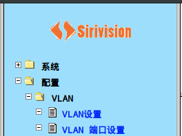
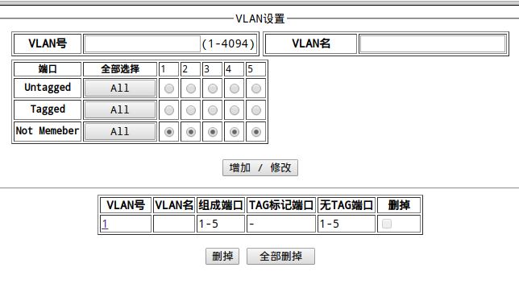
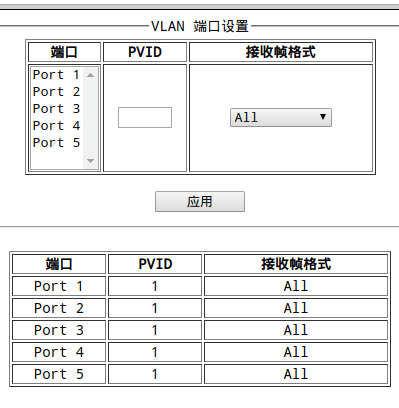

# 希力可WEB网管交换机VLAN配置

**实验设备：希力SR-SG2005简单网管交换机**

**VLAN有关菜单**



### VLAN设置

**注意！更改 VLAN1 的默认设置可能会导致交换机管理界面无法连接！**  
\(除非你知道你在干什么\)

**界面**




**1、界面元素解释**

* VLAN号： 表示一个VLAN所必需的号码，类似于身份证号 ****
* VLAN名： VLAN的别名，便于人理解该VLAN的用途 
* 端口： 对应交换机的端口号 
* Untagged、Tagged、Not Memeber Untagged: 接收与发送无该VLAN标记数据包的端口 Tagged: 接收与发送有该VLAN标记数据包的端口 Not Memeber: 不在该VLAN内的端口 
* \(下方\) VLAN号、VLAN名、组成端口、TAG标记端口、无TAG端口： 当前的VLAN配置，可点击VLAN号加载配置（便于在上方修改）

**与标准VLAN配置的联系\(Ruijie Switch CLI命令\)**

* VLAN号、VLAN名：

```text
(vlan)# vlan $id name $name
```

* 端口：

```text
(config-if)# switchport mode trunk
(config-if)# switchport trunk allowed vlan add $id
```

注意是trunk，不是access，因为它允许该端口传输多个VLAN以及无VLAN标记的包  
与下面 VLAN 端口设置 息息相关

### VLAN 端口设置

 **注意！更改接收帧格式设置可能会导致交换机管理界面无法连接！**  
\(除非你知道你在干什么\)

**界面**



**界面元素解释**

* 端口： 对应交换机的端口号
* PVID： 端口对应的VLAN号（Port VLAN ID）_\(妈耶就不能给个小字让人理解\)_
* 接收帧格式： ALL：接收所有帧 Untag-only：仅接收不含VLAN标记的帧 Tag-only：仅接收含VLAN标记的帧

**与标准VLAN端口配置的联系\(Ruijie Switch CLI命令\)**

**这个要所有合在一起了**

* 接收帧格式：ALL

```text
(config-if)# switchport mode trunk
(config-if)# switchport trunk native vlan $PVID
```

* 接收帧格式：Untag-only

```text
(config-if)# switchport mode access
(config-if)# switchport access vlan $PVID
```

* 接收帧格式：Tag-only（没找到不让Untag帧通过的命令:\( ）

```text
(config-if)# switchport mode trunk
```

#### 综合配置

**目的：**

* VLAN1为配置VLAN\(默认、不可更改\)，ip地址为10.1.1.100 /24
* VLAN100为传输VLAN，对用户透明，对路由器不透明
* VLAN233为特殊设备之间连接，在端口3、4，其中端口3下设备需要正常上网
* 端口5为trunk

VLAN设置：

| VLAN号 | VLAN名 | 组成端口 | TAG标记端口 | 无TAG端口 |
| :--- | :--- | :--- | :--- | :--- |
| 1 | Manager | 1-5 | 1-5 | - |
| 100 | Nornal link | 1-5 | - | 1-5 |
| 233 | Server link | 3-4 | 3-4 | - |

VLAN 端口设置：

| 端口 | PVID | 接受帧格式 |
| :--- | :--- | :--- |
| Port 1 | 1 | Tag-only |
| Port 2 | 100 | Untag-only |
| Port 3 | 100 | All |
| Port 4 | 233 | Tag-only |
| Port 5 | 1 | Tag-only |

命令行\(大概\)：

```text
# conf t
(config)# vlan 1
(config-vlan)# name Manager
(config)# vlan 100
(config-vlan)# name Nornal link
(config)# vlan 233
(config-vlan)# name Server link
(config-vlan)# exit
(config)# int r g0/1 , 0/5
(config-if)# switchport mode trunk
(config-if)# int g0/2
(config-if)# switchport mode access
(config-if)# switchport access vlan 100
(config-if)# int g0/3
(config-if)# switchport mode trunk
(config-if)# switchport trunk native vlan 100
(config-if)# int g0/4
(config-if)# switchport mode trunk
(config-if)# switchport trunk allowed vlan remove 2-232,234-4094
(config-if)# exit
(config)# int vlan 1
(config-if)# ip address 10.1.1.100 255.255.255.0
(config-if)# end
# wr
```

