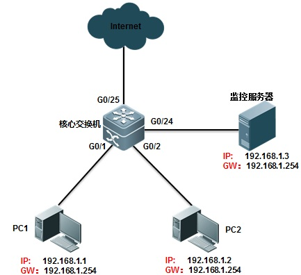
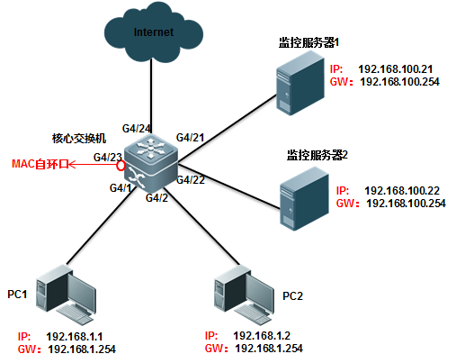

# 通过交换机的镜像功能抓包
**\*可能这篇不会更新思科的配置方法了 QAQ**

## 本地镜像
### 锐捷交换机(非11.X软件平台)
**\*交换机实体环境：Ruijie S2628G**  

<details>
<summary><strong>1. 官方文档</strong></summary>

<pre><code>
路径：实施一本通/四、功能配置/1、基础配置/7、镜像/1、多对一镜像(包含一对一镜像)
......
一、组网需求
配置端口镜像，实现监控服务器能够监控g0/1及g0/2口入方向和出方向的数据流，同时监控服务器依然能够实现对外网网络的访问

二、组网拓扑
</code></pre>

<pre><code>
三、配置要点
要实现监控服务器即能对外网网络的访问，需要在配置交换机端口镜像的目的端口后面加上switch关键字

四、配置步骤  
交换机配置：
Ruijie>enable                                     
Ruijie#configure terminal
Ruijie(config)#monitor session 1 source interface gigabitEthernet 0/1 both
------>指定端口镜像的源端口为g0/1，即被监控端口，交换机可以指定多个源端口。both表示双方向的数据流，
如果只需要镜像进入交换机方向的数据流，则将both关键字改为关键字rx，
命令就变为了：monitor session 1 source interface gigabitEthernet 0/1 rx。
如果只需要镜像从交换机出来方向的流量，则可将both关键字改为tx。

Ruijie(config)#monitor session 1 source interface gigabitEthernet 0/2 both
------>指定端口镜像的源端口g0/2，即被监控端口。交换机可以指定多个源端口。both表示双方向的数据流，
如果只需要镜像进入交换机方向的数据流，则将both关键字改为关键字rx，
如果只需要镜像从交换机出来方向的流量，则可将both关键字改为tx。

Ruijie(config)#monitor session 1 destination interface gigabitEthernet 0/24 switch
------>指定g0/24口为端口镜像的目的端口，即监控端口。后面加了一个关键字swith，表示目的端口也能够上网，
如果不加关键字，那么该端口将不能访问外网。（11.x版本强制要加此关键字）

Ruijie(config)#end
Ruijie#wr
......
</code></pre>

</details>

#### 2. 实验
1. 准备一台上网机(本文使用Linux)，一台电脑抓包(ArchLinux with Wireshark)，以及一台可网管交换机(Ruijie S2628G)  
2. 由于实验时交换机仍需要正常工作，因此选用f0/10与f0/20端口进行连线，上网机连f0/10，电脑连f0/20
3. 确定上网机能正常上网
4. 进行交换机配置：  
1）进入全局模式  
2）输入命令：`monitor session 1 source interface f0/10 both` `monitor session 1 destination interface f0/20`  
2.1）命令中监控端口没有加switch关键字是为了不抓到本机的包  
3）用网线连接交换机与电脑，关闭电脑上任何进行网络通讯的进程，开启对eth0(电脑网卡)的抓包，确定无法抓取任何包  
3.1）建议关闭网络管理服务，如：NetworkManager。以及DHCP服务，如：dhclient。避免产生DHCP以及其他广播包  
4）在确定电脑启动抓包时将上网机插入交换机，同时能观察到电脑上抓取到数据包  
5）为确认抓取到的包是上网机的，在上网机完成网络初始化后获取其IP，并对任意一个能ping通的IP地址发送ICMP包  
5.1）在电脑上抓取到ICMP报文后观测其目的IP，若IP正确，则能确保一对一镜像配置成功。  
\*注：配置一对一镜像或多对一镜像并不会影响监控端口原本的配置。在不需要使用该功能时输入`no monitor session 1 source interface f0/10 both` `no monitor session 1 destination interface f0/20`  即可

## 远程镜像
### 锐捷交换机(11.X软件平台)
**\*交换机实体环境：Ruijie N18010, S6220-48XS4QXS**  

<details>
<summary><strong>1. 官方文档</strong></summary>

<pre><code>
路径：实施一本通/四、功能配置/1、基础配置/7、镜像/1、多对一镜像(包含一对一镜像)
......
一、组网需求

g4/1及g4/2下面连接用户，g4/21及g4/22连接两台监控服务器，现在需要实现监控服务器1及监控服务器2都能监控g4/1及g4/2口的数据流

二、组网拓扑
</code></pre>

<pre><code>s
三、配置要点
1）在核心交换机上创建Remote VLAN。
2）指定核心交换机为RSPAN的源设备，配置直连PC1，PC2的端口g4/1及g4/2为镜像源端口；选择一个Down状态（无需手工shutdown）的端口（本例为G 4/23）为镜像输出端口，将该端口加入Remote VLAN，并配置为MAC自环。（这里的down状态的端口不是指手动将接口shutdown，而是这个接口之前没有使用，没有连线）
3）将直连监控服务器1，监控服务器2的G4/21，G4/22端口加入Remote VLAN。
 
重点说明：
1）需要在交换机上将一个未使用的端口配置成为一个mac自环口，配置为mac自环口后，该端口不插网线或光线，接口会自动UP，并且接口状态灯亮绿色。MAC不能做其他配置，也不要打开此接口的交换功能（monitor session 1 destination remote vlan 100 interface gigabitEthernet 4/23  不要携带switch 选项）否则可能导致监控服务器无法接收到监控数据流
 
四、配置步骤  
交换机配置：
1、在交换机上配置Remote VLAN。
在交换机上创建Remote VLAN 100。 ------>这个VLAN需要是在交换机上没有使用的业务VLAN
Ruijie#configure terminal 
Ruijie(config)#vlan 100
Ruijie(config-vlan)#remote-span  
Ruijie(config-vlan)#exit
 
2、配置RSPAN源设备。
在交换机上创建RSPAN Session 1，指定该设备为源设备，并配置端口g4/1及g4/2为源端口（源端口配置任意），镜像双向数据流。
Ruijie(config)#monitor session 1 remote-source
Ruijie(config)#monitor session 1 source interface gigabitEthernet 4/1 both
Ruijie(config)#monitor session 1 source interface gigabitEthernet 4/2 both
指定自环口g4/23为镜像的目的端口
Ruijie(config)#monitor session 1 destination remote vlan 100 interface gigabitEthernet 4/23 ------>将流量引入到loopback口，最后面不要携带switch命令
Ruijie(config)#interface gigabitEthernet 4/23
Ruijie(config-if-GigabitEthernet 4/23)#switchport access vlan 100
Ruijie(config-if-GigabitEthernet 4/23)#mac-loopback         ------>环回口会不要再做其他配置，也不要连接线缆。
Ruijie(config-if-GigabitEthernet 4/23)#end
Ruijie# clear mac-address-table dynamic interface gigabitEthernet 4/23    ------>配置完成后需要清下自环口的mac地址表
 
3、将监控服务器的端口g4/21及g4/22加入Remote VLAN
配置交换机的端口g4/21和g4/22属于Remote VLAN 100。
Ruijie(config)#interface range gigabitEthernet 4/21-22
Ruijie(config-if-range)#switchport access vlan 100
Ruijie(config-if-range)#end
Ruijie#wr
重点说明：
注意：如果S86上面开启了生成树协议，同时有其他trunk口，由于RSPAN的镜像目的口有MAC- loopback功能，会导致流量在remote-vlan中打环，所以需要在所有trunk口上做vlan修剪，本例中remove vlan 100。
 
指定自环口g4/23为镜像的目的端口配置中如果开启了switch关键字，那么需要在自环口关闭mac地址学习功能，并且清除自环口的MAC地址表项，如果没有敲switch关键字则无不需要关闭自环口的mac地址学习功能。
</code></pre>s

</details>

#### 2. 实验
1. 准备一台电脑配置(ArchLinux)，以及两台三层核心交换机(Ruijie N18010 与 S6220)  
2. N18010 上 Te3/10 连接上网设备， Te3/1 连接 S6220 的 Te0/50， Te 3/23 为自环口
3. 确定 N18010 下联设备正常上网  
4. 在 N18010 上进行配置  
    4.1. 进入全局模式  
    4.2. 创建远程VLAN  
    ```
    N18010# configure terminal
    N18010(config)# vlan 1001
    N18010(config-vlan)# remote-span
    N18010(config-vlan)# exit
    ```
    4.3. 配置镜像源端口  
    ```
    N18010(config)# monitor session 1 remote-source
    N18010(config)# monitor session 1 source interface TenGigabitEthernet 3/10 both
    ```  
    4.4. 配置自环口  
    ```
    N18010(config)# monitor session 1 destination remote vlan 1001 interface TenGigabitEthernet 3/23 
    N18010(config)# interface TenGigabitEthernet 3/23
    N18010(config-if-TenGigabitEthernet 3/23)# switchport access vlan 1001
    N18010(config-if-TenGigabitEthernet 3/23)# no mac-address-learning
    N18010(config-if-TenGigabitEthernet 3/23)# mac-loopback
    ```
    4.5. 配置VLAN裁剪  
    **裁剪掉除Te3/1以外所有Trunk口的VLAN1001**
5. 在 S6220 上配置  
   5.1. 进入全局模式  
   5.2. 创建VLAN  
    ```
    S6220# configure terminal
    S6220(config)# vlan 1001
    S6220(config-vlan)# name remote-span from N18010
    S6220(config-vlan)# exit
    ```  
   5.3. 配置镜像目的端口  
    ```
    N18010(config)# interface TenGigabitEthernet 0/49
    N18010(config-if-TenGigabitEthernet 0/49)# switchport access vlan 1001
    N18010(config-if-TenGigabitEthernet 0/49)# no mac-address-learning
    ```
